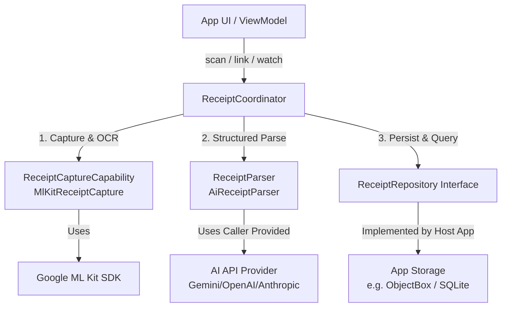
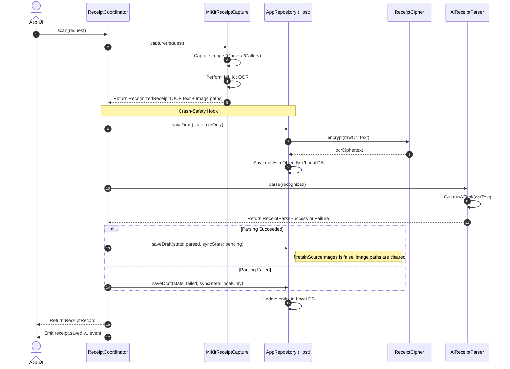

# Scan Receipt Plugin: Architecture & Data Handling Guide

The `scan_receipt` plugin is a pure-logic, platform-agnostic Flutter plugin designed to handle the capture, optical character recognition (OCR), structured parsing (using AI), and transaction-linking of financial receipts.

To prevent database conflicts and duplicate database sessions, **the plugin is fully database-agnostic** and does not include any direct persistence layer or dependencies like ObjectBox. Instead, it exposes a clean interface, `ReceiptRepository`, which the host application implements.

---

## 📖 Table of Contents
1. [System Architecture](#-system-architecture)
2. [Data Lifecycle & Flow](#-data-lifecycle--flow)
3. [Host App Implementation Guide (ObjectBox)](#-host-app-implementation-guide-objectbox)
   - [Part A: Database Entities](#part-a-database-entities)
   - [Part B: Repository Implementation](#part-b-repository-implementation)
   - [Part C: Legacy Migrator (Optional)](#part-c-legacy-migrator-optional)
4. [Step-by-Step App Wiring](#-step-by-step-app-wiring)
5. [Security & Privacy Standards](#-security--privacy-standards)

---

## 🏗 System Architecture

The plugin is structured around a decoupled, interface-driven architecture where persistence and capabilities are injected at runtime:



- **`ReceiptCoordinator`**: The central orchestrator managing the workflow and publishing events.
- **`ReceiptCaptureCapability`**: Responsible for obtaining receipt images and executing OCR. The default implementation is `MlKitReceiptCapture` using Google Play Services ML Kit.
- **`ReceiptParser`**: Accepts recognized text and uses an AI function to return structured JSON. The default implementation is `AiReceiptParser`.
- **`ReceiptRepository`**: An abstract interface defined by the plugin for saving and querying receipts.
- **`ReceiptCipher`**: An interface defined by the plugin to encrypt and decrypt sensitive OCR text at rest.

---

## 🔄 Data Lifecycle & Flow

Every receipt scanned follows a strict phase progression to ensure crash-safety, data privacy, and minimal device storage overhead:



1. **Capture & OCR**: The document scanner (for camera capture) or the image picker (for gallery uploads) retrieves JPEG images. The plugin invokes ML Kit Text Recognition to extract raw OCR text.
2. **Immediate Persistence (Draft)**: Before calling the AI provider, the coordinator saves an `ocrOnly` draft to the repository. This ensures that if the app is killed or loses internet during the AI call, the user's scan is not lost.
3. **AI Parsing**: The raw OCR text is sent to the developer-defined AI wrapper, returning structured JSON matching the database schema.
4. **Final Save & Image Clean up**: The structured data is parsed and stored. If `retainSourceImages` is configured as `false` (default), the file paths of the local source images are discarded from the draft metadata to allow the system to garbage-collect the temporary images and save space.
5. **Event Dispatch**: A domain event is published (e.g., `receipt.saved.v1` or `receipt.parse.failed.v1`) to wire into analytics or sync triggers.

---

## 💾 Host App Implementation Guide (ObjectBox)

Since the host app controls database initialization, you can copy the following template files directly into your project's data module.

### Part A: Database Entities
Add these entities to your app's ObjectBox database entities folder:

```dart
// lib/data/receipt_entities.dart
import 'package:objectbox/objectbox.dart';

@Entity()
class ReceiptRecordEntity {
  @Id()
  int objectBoxId;

  @Unique()
  String receiptId;

  int schemaVersion;

  // OCR text encrypted at rest; empty string for legacy-migrated records
  String ocrCiphertext;
  String contentHash;
  String sourcePathsJson;

  // JSON-encoded ParsedReceipt summary (merchant, currency, total, items)
  String parsedJson;

  String parseState;
  String syncState;
  String? linkedTransactionId;
  String? lastErrorCode;
  int retryCount;

  @Property(type: PropertyType.date)
  DateTime capturedAt;

  @Property(type: PropertyType.date)
  DateTime createdAt;

  @Property(type: PropertyType.date)
  DateTime updatedAt;

  ReceiptRecordEntity({
    this.objectBoxId = 0,
    required this.receiptId,
    this.schemaVersion = 1,
    required this.ocrCiphertext,
    required this.contentHash,
    required this.sourcePathsJson,
    required this.parsedJson,
    required this.parseState,
    required this.syncState,
    this.linkedTransactionId,
    this.lastErrorCode,
    this.retryCount = 0,
    required this.capturedAt,
    required this.createdAt,
    required this.updatedAt,
  });
}

@Entity()
class ReceiptSyncJobEntity {
  @Id()
  int id;

  @Index()
  String receiptId;

  String operation;
  String idempotencyKey;
  int attempts;
  String? lastErrorCode;

  @Property(type: PropertyType.date)
  DateTime nextAttemptAt;

  ReceiptSyncJobEntity({
    this.id = 0,
    required this.receiptId,
    required this.operation,
    required this.idempotencyKey,
    this.attempts = 0,
    this.lastErrorCode,
    required this.nextAttemptAt,
  });
}
```

---

### Part B: Repository Implementation
Create the repository class implementing the plugin's `ReceiptRepository` interface:

```dart
// lib/data/objectbox_receipt_repository.dart
import 'dart:async';
import 'dart:convert';

import 'package:objectbox/objectbox.dart';
import 'package:scan_receipt/scan_receipt.dart';
import 'receipt_entities.dart';

final class ObjectBoxReceiptRepository implements ReceiptRepository {
  final Box<ReceiptRecordEntity> box;
  final ReceiptCipher cipher;
  final StreamController<void> _changes = StreamController<void>.broadcast(sync: true);

  ObjectBoxReceiptRepository({required this.box, required this.cipher});

  @override
  Stream<List<ReceiptSummary>> watch(ReceiptQuery query) async* {
    yield await _summaries(query);
    await for (final _ in _changes.stream) {
      yield await _summaries(query);
    }
  }

  @override
  Future<ReceiptRecord?> getById(String id) async {
    final entity = box.getAll().where((e) => e.receiptId == id).firstOrNull;
    return entity == null ? null : await _decode(entity);
  }

  @override
  Future<ReceiptRecord?> getByTransactionId(String transactionId) async {
    final entity = box.getAll().where((e) => e.linkedTransactionId == transactionId).firstOrNull;
    return entity == null ? null : await _decode(entity);
  }

  @override
  Future<ReceiptRecord> saveDraft(ReceiptDraft draft) async {
    final existing = box.getAll().where((e) => e.receiptId == draft.id).firstOrNull;
    final now = DateTime.now().toUtc();

    final entity = ReceiptRecordEntity(
      objectBoxId: existing?.objectBoxId ?? 0,
      receiptId: draft.id,
      ocrCiphertext: await cipher.encrypt(draft.recognized.ocrText),
      contentHash: draft.recognized.contentHash,
      sourcePathsJson: jsonEncode(draft.recognized.sourcePaths),
      parsedJson: jsonEncode(_parsedToJson(draft.parsed)),
      parseState: draft.parseState.name,
      syncState: draft.syncState.name,
      linkedTransactionId: draft.linkedTransactionId,
      capturedAt: draft.recognized.capturedAt,
      createdAt: existing?.createdAt ?? now,
      updatedAt: now,
    );
    box.put(entity);
    _changes.add(null);
    return (await getById(draft.id))!;
  }

  @override
  Future<void> link(String receiptId, String transactionId) => _updateLink(receiptId, transactionId);

  @override
  Future<void> unlink(String receiptId) => _updateLink(receiptId, null);

  @override
  Future<void> delete(String receiptId) async {
    final entity = box.getAll().where((e) => e.receiptId == receiptId).firstOrNull;
    if (entity != null) box.remove(entity.objectBoxId);
    _changes.add(null);
  }

  @override
  Future<void> retry(String receiptId) async {
    final record = await getById(receiptId);
    if (record == null) return;
    await saveDraft(
      ReceiptDraft(
        id: record.draft.id,
        recognized: record.draft.recognized,
        parsed: record.draft.parsed,
        parseState: ReceiptParseState.ocrOnly,
        syncState: record.draft.syncState,
        linkedTransactionId: record.draft.linkedTransactionId,
      ),
    );
  }

  Future<void> _updateLink(String receiptId, String? transactionId) async {
    final entity = box.getAll().where((e) => e.receiptId == receiptId).firstOrNull;
    if (entity == null) throw StateError('Receipt $receiptId not found.');
    entity.linkedTransactionId = transactionId;
    entity.updatedAt = DateTime.now().toUtc();
    box.put(entity);
    _changes.add(null);
  }

  Future<List<ReceiptSummary>> _summaries(ReceiptQuery filter) async {
    final entities = box.getAll()..sort((a, b) => b.capturedAt.compareTo(a.capturedAt));
    return entities
        .where((e) =>
            (filter.transactionId == null || e.linkedTransactionId == filter.transactionId) &&
            (filter.includeUnlinked || e.linkedTransactionId?.isNotEmpty == true))
        .take(filter.limit)
        .map((e) {
          final decoded = jsonDecode(e.parsedJson);
          final map = decoded is Map ? decoded.cast<String, dynamic>() : const {};
          return ReceiptSummary(
            id: e.receiptId,
            merchant: map['merchant_name']?.toString() ?? 'Unparsed receipt',
            totalMinor: map['total_minor'] as int?,
            currency: map['currency']?.toString() ?? 'KES',
            capturedAt: e.capturedAt,
            linkedTransactionId: e.linkedTransactionId,
            parseState: ReceiptParseState.values.byName(e.parseState),
            syncState: ReceiptSyncState.values.byName(e.syncState),
          );
        })
        .toList(growable: false);
  }

  Future<ReceiptRecord> _decode(ReceiptRecordEntity entity) async {
    final sourcePaths = (jsonDecode(entity.sourcePathsJson) as List)
        .map((v) => v.toString())
        .toList(growable: false);
    final parsedRaw = jsonDecode(entity.parsedJson);
    final parsed = parsedRaw is Map<String, dynamic> ? _parsedFromJson(parsedRaw) : null;

    final draft = ReceiptDraft(
      id: entity.receiptId,
      recognized: RecognizedReceipt(
        ocrText: await cipher.decrypt(entity.ocrCiphertext),
        sourcePaths: sourcePaths,
        contentHash: entity.contentHash,
        capturedAt: entity.capturedAt,
      ),
      parsed: parsed,
      parseState: ReceiptParseState.values.byName(entity.parseState),
      syncState: ReceiptSyncState.values.byName(entity.syncState),
      linkedTransactionId: entity.linkedTransactionId,
    );
    return ReceiptRecord(
      draft: draft,
      createdAt: entity.createdAt,
      updatedAt: entity.updatedAt,
    );
  }

  static Map<String, dynamic> _parsedToJson(ParsedReceipt? p) => {
    if (p != null) ...{
      'merchant_name': p.merchantName,
      'currency': p.currency,
      'total_minor': p.totalMinor,
      'items': [
        for (final item in p.items)
          {
            'sku': item.sku,
            'name': item.name,
            'quantity': item.quantity,
            'unit_price_minor': item.unitPriceMinor,
            'total_price_minor': item.totalPriceMinor,
          },
      ],
    },
  };

  static ParsedReceipt? _parsedFromJson(Map<String, dynamic> json) {
    if (json.isEmpty) return null;
    return ParsedReceipt(
      merchantName: json['merchant_name']?.toString(),
      currency: json['currency']?.toString() ?? 'KES',
      totalMinor: json['total_minor'] as int?,
      items: (json['items'] as List<dynamic>? ?? const [])
          .whereType<Map>()
          .map((raw) {
            final item = raw.cast<String, dynamic>();
            return ReceiptItem(
              sku: item['sku']?.toString(),
              name: item['name']?.toString() ?? 'Unknown item',
              quantity: item['quantity']?.toString(),
              unitPriceMinor: item['unit_price_minor'] as int?,
              totalPriceMinor: item['total_price_minor'] as int?,
            );
          })
          .toList(growable: false),
    );
  }
}
```

---

### Part C: Legacy Migrator (Optional)
If your app needs to migrate legacy `UserReceipt` rows (JSON string data keyed by ObjectBox ID) to the new structure, copy this helper:

```dart
// lib/data/legacy_receipt_migrator.dart
import 'dart:convert';
import 'package:scan_receipt/scan_receipt.dart';

final class LegacyReceiptMigrator {
  final List<Map<String, dynamic>> legacyRows;
  final ReceiptRepository target;

  const LegacyReceiptMigrator({
    required this.legacyRows,
    required this.target,
  });

  Future<int> migrate() async {
    var migrated = 0;
    for (final row in legacyRows) {
      final legacyId = row['id'] as int? ?? 0;
      final id = 'legacy_receipt_$legacyId';
      if (await target.getById(id) != null) continue;

      final decoded = jsonDecode(row['data'] as String? ?? '{}');
      final map = decoded is Map ? decoded.cast<String, dynamic>() : <String, dynamic>{};
      final transactionId = row['transactionId'] as String?;
      final now = DateTime.now().toUtc();

      await target.saveDraft(
        ReceiptDraft(
          id: id,
          recognized: RecognizedReceipt(
            ocrText: '',
            sourcePaths: const [],
            contentHash: 'legacy-$legacyId',
            capturedAt: now,
          ),
          parsed: ParsedReceipt(
            merchantName: _merchant(map),
            currency: _currency(map),
            totalMinor: _minor(_financial(map)['total']),
          ),
          parseState: ReceiptParseState.parsed,
          syncState: ReceiptSyncState.localOnly,
          linkedTransactionId: (transactionId?.startsWith('receipt_unlinked_') ?? true)
              ? null
              : transactionId,
        ),
      );
      migrated++;
    }
    return migrated;
  }

  static Map<String, dynamic> _financial(Map<String, dynamic> map) {
    final value = map['financial_summary'];
    return value is Map ? value.cast<String, dynamic>() : const {};
  }

  static String? _merchant(Map<String, dynamic> map) {
    final value = map['merchant_info'];
    return value is Map ? value['name']?.toString() : null;
  }

  static String _currency(Map<String, dynamic> map) =>
      _financial(map)['currency']?.toString() ?? 'KES';

  static int? _minor(Object? value) {
    final amount = value is num ? value.toDouble() : double.tryParse(value?.toString() ?? '');
    return amount == null ? null : (amount * 100).round();
  }
}
```

---

## 🛠 Step-by-Step App Wiring

### Step 1: Implement `ReceiptCipher`
Define how you encrypt OCR data in the host application:
```dart
class MyReceiptCipher implements ReceiptCipher {
  @override
  Future<String> encrypt(String plaintext) async => myEncrypt(plaintext);

  @override
  Future<String> decrypt(String ciphertext) async => myDecrypt(ciphertext);
}
```

### Step 2: Initialize ObjectBox Box
Provide the ObjectBox Box from your application's existing database store:
```dart
final Store store = await openStore();
final Box<ReceiptRecordEntity> receiptBox = store.box<ReceiptRecordEntity>();
```

### Step 3: Write your AI function
Define how OCR text maps to JSON:
```dart
Future<Map<String, dynamic>> myAiFunction(String ocrText) async {
  final response = await myProvider.complete(
    systemPrompt: AiReceiptParser.defaultSystemPrompt,
    userMessage: 'Parse receipt:\n\n$ocrText',
  );
  return jsonDecode(response) as Map<String, dynamic>;
}
```

### Step 4: Assemble `ReceiptCoordinator`
Now configure the coordinator with your repository implementation:
```dart
final coordinator = ReceiptCoordinator(
  capture: MlKitReceiptCapture(),
  parser: AiReceiptParser(runAiTask: myAiFunction),
  repository: ObjectBoxReceiptRepository(
    box: receiptBox,
    cipher: MyReceiptCipher(),
  ),
);
```

---

## 🔒 Security & Privacy Standards

- **Encryption At Rest**: The `ocrCiphertext` field is protected using the client-supplied `ReceiptCipher`. Cleartext OCR contents never hit the database disk.
- **Image Deletion Policy**: Temporary scanned pages are saved as local files for ML Kit OCR execution. If `retainSourceImages` is set to `false`, these file locations are forgotten by the coordinator immediately after OCR succeeds, allowing standard system directories to automatically delete them.
- **Zero-Leak Logging**: The plugin guarantees that no raw OCR text, parsed item descriptions, or financial parameters are output to stdout/logging frameworks outside of `kDebugMode`.
